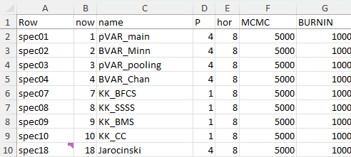
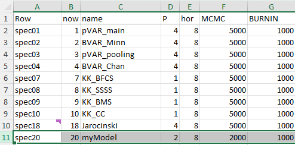

# Replication material for "Improving inference and forecasting in VAR models using cross-sectional information"
by [Boris Blagov](https://borisblagov.com) and [Jan Prüser](https://sites.google.com/view/janprueser/welcome)

This code comes without support of any kind. The code has been tested on the following Matlab versions: Matlab 2019a, Matlab2020a on Windows 11 machines. Only calculating the inefficiency factors requires the Econometrics Toolbox, all other functions should work without any additional tooling. The results for Sections 4 and 5 are saved in an Excel file, so an installation of MS Excel would be required for that.

The data is publicly available and is included with the replication files. For the main forecasting analysis we used the [GVAR dataset from Kamiar Mohaddes](https://www.mohaddes.org/gvar), specifically the 2023 vintage. The Euro Area dataset has been collected from [Eurostat](https://ec.europa.eu/eurostat/data/database) through the software Macrobond.

You would need about 1 GB of hard drive space and the program must be able to write data to disk.

Folder structure and notable files:
```
├── BEAR\
    ├── bear_4_2.m          Main file for the estimating of the Jarocinski model for Section 5
├── data\
├── functions\
├── images\
├── figures\
    ├── Create_Figure_Lambdas.m File to create Figure 2 in Section 3
├── MonteCarlo_rev\
    ├── Tables_Section_4.m  File to create the output for the Monte Carlo analysis in Excel and Matlab
├── Results\
    ├── Tables_Section_5.m  File to write all of the matlab output from Sectino 5 estimations in Excel
├── Main.m                   Main file for use in your own research           
├── Main_Section_3.m         Main file for replicating the impulse response functions (IRFs) in Section 3
├── Main_Section_4.m         Main file for replicating the Monte Carlo study in Section 4
├── Main_Section_5.m         Main file for replicating the forecasting part in Section 5
├── PanelVAR_output.xlsx     Setup file for the forecasting analysis (Section 5) 
├── PanelVAR_MC.xlsx         Setup for the Monte Carlo (Section 4)
├── README.md                This file
```


## Replication of Section 3

1. Run ```Main_Section_3.m```. You can uncomment the different lines to get the desired aspects from the Section. The IRFs will generate two ```.mat``` files about 45MB each.

The file wil create Figure 1 in the paper
To recreate Figure 2 in the paper run ```Create_Figure_Lambdas.m``` in ```figures\```

## Replication of Section 4

1. Run ```Main_Section_4.m```. This will take a long time, in our case it was a bit more than a week. Note that it will create a file called ```MC_dataset_rev.mat``` in the main folder that will be 451 MB.
2. Once the code runs it will generate additional twelve ```.mat``` files in the folder ```MonteCarlo_rev\```, each approximately 51 MB.
3. Navigate to ```MonteCarlo_rev\``` and run the file ```Tables_Section_4.m```. This will show the tables in matlab and create a file called ```MC_results.xlsx```.


## Replication of Section 5

1. Run Main_Section_5.m. This is the main file and will do estimations of 9 from the total of 10 models.
Note that this took about four to six weeks on our machine. It is possible to split the estimation model by model, but the file is currently programmed to do the estimations sequentially without any input from the user.
The code does the forecasts for all models except the model by Jarocinski (2010). This was done in the BEAR toolbox. If you want to replicate the full tables from Section 5 do the following.
2. Navigate to the folder ```\BEAR\``` and open the file bear_4_2.m in matlab.
3. Copy the *absolute* path to that file, e.g. ```C:\Paper Panel VAR replication\BEAR``` (or wherever this folder is) to the clipboard.
4. Paste the absolute path to the file on line 36 in between the apostrophies, e.g. the line should read
```pref.datapath = 'C:\Paper Panel VAR replication\BEAR';```.
5. Run the file bear_4_2.m. It will open a window. On that window at the bottom you again need ot paste the path.
6. Leave all other properties as they are and press Next\Ok until the estimatino finishes. It would take a while, on our machines it was several hours.
7. Navigate to ```\Results\``` and run the file ```Tables_Section_5.m```.
8. Open The file Resuts.xlsx and go to the tab in the excel ribbon called "Data" and click on "Refresh all". This would update the pivot tables from the paper.


## Using the code for your own analysis

We have prepared the file ```Main_Research.m```, which is a copy of ```Main_Section_5.m```

### Model specification
The models in the paper have been can be specified in the file ```PanelVAR_output.xlsx```. The code reads this file and depending on the column entries chooses the appropriate specification. 

We have prepared the following specifications for the models based on zero shrinkage:
- 1. pVAR_main:  combines zero shrinkage with pooling over countries, this paper
- 2. BVAR_Minn:  classical BVAR with only zero shrinkage (baseline)
- 3. pVAR_pooling: our approach without zero shrinkage, resembles a more classical panel VAR, this paper
- 4. BVAR_Chan:  zero shrinkage with global local prior as in Chan 2021

We have the follwoing panel VAR benchmarks
- 7. KK_BFCS:   Bayesian factor clustering and selection (BFCS) as in Korobilis (2016), only works with 1 lag
- 8. KK_SSSS:   based on Koop and Korobilis (2015), only works with 1 lag
- 9. KK_BMS:    Bayesian mixture shrinkage BMS, as in Korobilis (2016), only works with 1 lag
- 10. KK_CC:    factor  shrinkage prior (Canova and Ciccarelli, 2009)
- 18. J:        hierarchical panel VAR as in Jarocinski (2010). NOTE THAT THIS DOES IS NOT CODED IN Main.m, we have used the BEAR Toolbox for the results from this model.
Columns D to H are relevant for the user, you can specify the number of lags (P), the forecast horizon (hor), the number of draws (MCMC) and the number of for burn-in (BURNIN). Note that the panel VAR benchmarks do not work with lags lengths longer than 1, that is inherent limitation of these models.



Columns H to W are to be left as they are. These columns tell the code how to specify the variance covariance matrix of the prior to achieve the desired models. We discuss the theory in eq. (9) and (10) in the paper. For example in eq. (9), setting the right part to 0 leaves only Minnesota prior (e.g. by setting $\lambda$ and $\tau$ to very large numbers), while setting the left part of the equation to 0 leaves only pooling.

If you want to change something (e.g. use different lags or more MCMC draws, etc), you can copy  the desired row as a new specification (spec). For example, suppose that you want to use our model (```spec01) with 2 lags and 2000 draws, you can copy the first row to line row 11 and then modify columns A to G, by calling it spec20; no: 20, renaming it to myModel, and adjusting the rest.




Once you have adjusted the file ```PanelVAR_output.xlsx``` as you want, change line 19 to estimate the desired models. E.g. if you want to estimate our main specification along with the above example with fewer lags (spec20), then change line 19 to
```matlab
setup_spec_vec= [1 20];
```


### Data specification

We do not provide any functions for data wrangling as we have done all our preprocessing before. You can add your own data in any way you like. Our code is very flexible and can loop over different datasets or different variablesets from the same dataset. This is done in the following places:

- Lines 56 to 68
```matlab
switch data_spec
    case 1
        % example case for your own data
        data_spec_str   = 'N10G3';                      % name for saving/remembering the specification
        countries       = {'DE','FR','IT','ES','NL','BE','AT','PT','FI','GR'}; % country names in your panel
        common_vars     = {'RGDP', 'HICP','EURIBOR'};   % variable names in your panel
        n_pseudo        = 40;                           % number of pseudo out of sample iterations                   
    case 36
        % data for replication
        data_spec_str   = 'N15G3f';
        countries       =  {'DE','FR','IT','GB','US','CA','AG','BR','MX','CN','JP','AU','AT','IN','CH'};
        common_vars     = {'y', 'Dp','r'};  
end  % End cases for the data settings                
```
We have prepared ```case 1```, you can add your own cases. We use ```N``` for number of countries and ```G``` for number of variables. Our code is written for a balanced panel, but technically unbalanced panel could also be possible. That would require, however, an extention to the code. Change the lines in ```case 1``` accordingly. 


- Lines 84 to 92
```matlab
for ip = 1:N
    if data_spec >= 30 && data_spec< 40
        load GVAR_balanced
        fdata_mat(:, G*(ip-1)+1:G*ip) = GVAR_balanced.(countries{ip}){:,common_vars};
    elseif data_spec < 30
        % add your own data here
        load ownData
        fdata_mat(:, G*(ip-1)+1:G*ip) = ownData.(countries{ip}){:,common_vars};
    end
    for iq = 1:G
        var_list{1,(ip-1)*(G) + iq}                = strcat(common_vars{1,iq},'_',countries{1,ip});
    end
end
```
Here we have prepared the ```elseif``` statement. You can add as many as you want, you can use one for all ```data_spec``` case statements or one per ```data_spec``` case statement. Here is where you load your data. 

The model requires a large matrix, called ```fdata_mat``` with the data from all variables and all countries, ordered with the variable and country ordering from lines 56 to 68. In the above Euro Area example, the variable columns of the file fdata_mat should correspond do ```DE GDP, DE HICP, DE EURIBOR, FR GDP, FR HICP, FR EURIBOR``` and so on. This is important, because we are pooling the equations by skipping every G columns. In the three variable example, column 1, 4, 7 and so on correspond to the GDP equation for every country.

Note that you do not need to put your data in a structure like we did. If you do not, feel free to adjust the lines.
```matlab
load ownData
fdata_mat(:, G*(ip-1)+1:G*ip) = ownData.(countries{ip}){:,common_vars};
```
You can simply add a matrix that follows the convention and call it fdata_mat.

Finally go back to line 36 and configure the data cases that you have added, using the ```data_spec_vec``` variable, e.g.
```matlab
data_spec_vec   =[1];
```
    
###
Having specified the models and the data over which to loop, simply run the code. The Output for each will be saved under ```Results\``` and then the specification name given as explained above. 

If you do use this code please cite the paper Prüser, J. and Blagov, B. (2026). Thanks!

# References
Prüser, J. and Blagov, B. (2026). Improving inference and forecasting in VAR models using cross-sectional information, Economic Modelling.

Chan, J. (2021). Minnesota-type adaptive hierarchical priors for large Bayesian VARs. International Journal of Forecasting, 37(3):1212–1226

Canova, F. and Ciccarelli, M. (2013). Panel Vector Autoregressive models: A survey. ECB Discussion paper.

Jarocinski, M. (2010). Responses to monetary policy shocks in the east and the west of Europe: a comparison. Journal of Applied Econometrics, 25(5):833–868.

Koop, G. and Korobilis, D. (2015). Model uncertainty in panel vector autoregressions. European Economic Review, 81:115–131

Korobilis, D. (2016). Prior selection for panel vector autoregressions. Computational Statistics and Data Analysis, 101:110–120.